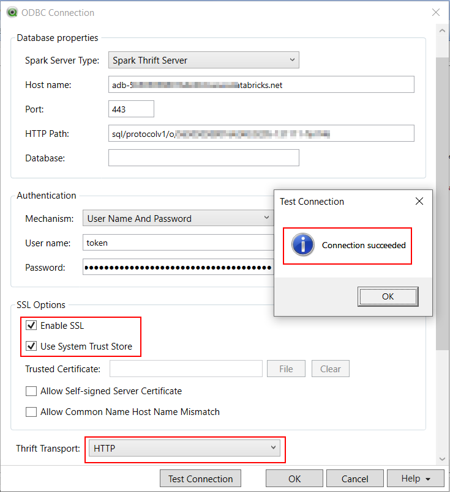
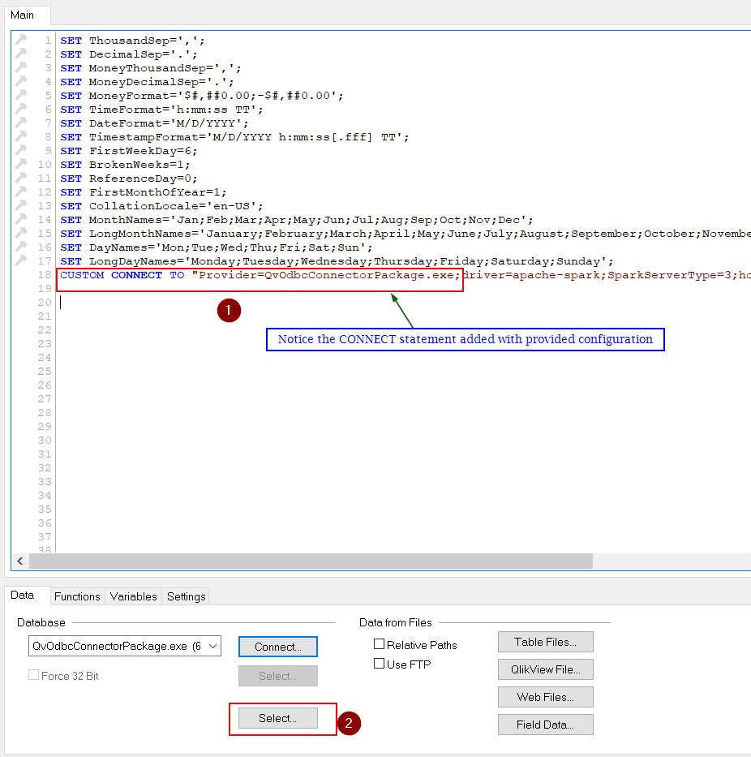
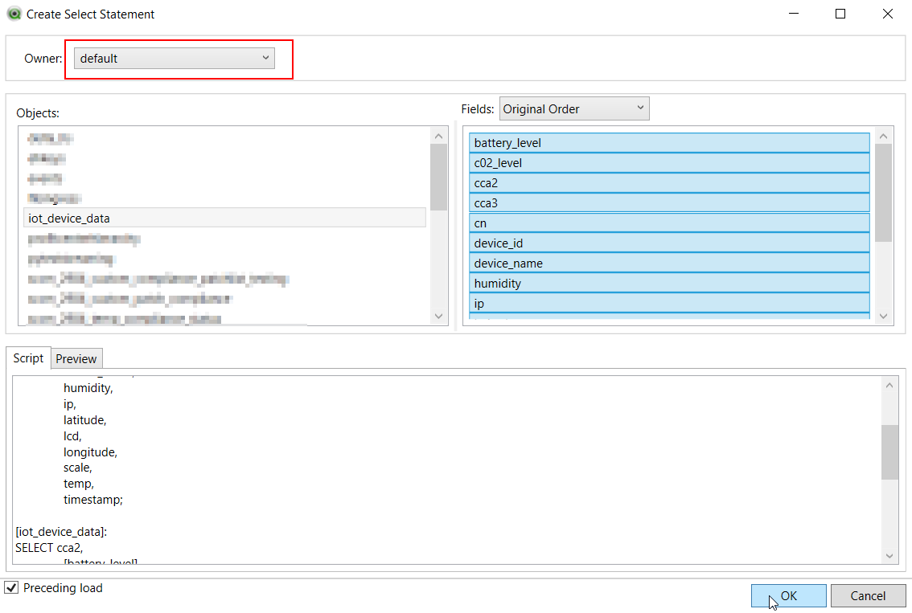
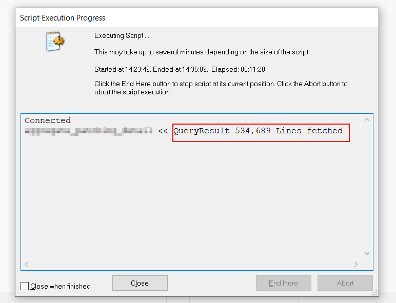

# Azure Databricks Integration with QlikView
## Components
- [x] Azure Databricks
- [x] QlikView Desktop (with QlikOdbcConnectorPackage_setup.exe installed)

Related Article: [Setup QlikView Databricks Integration with Simba Driver](Setup-with-SimbaDriver.md)


### Instructions
1. First let's collect Azure Databricks related configuration as follows:
   - Select Cluster <br/>
   Azure Databricks &#8594; Clusters (select the cluster for compute and return results to QlikView)
   - Get Configuration  <br/>
    Configuration tab &#8594; Advanced Settings &#8594; JDBC/ODBC
   - Gather following highlighted details

   - Generate personal token in Azure Databricks with proper comment and Lifetime (0 for live indefinitely)<br/>
   User Settings &#8594; Generate New Token
   - Copy this data to some file for further use

2. Make sure to have the following configuration and configure the Qlik ODBC connector connection by selecting ```Apache Spark``` driver as provider
   
    | Parameter/ Setting | Value                                                                                                    |
    | :----------------- | :------------------------------------------------------------------------------------------------------- |
    | Spark Server Type  | Spark Thrift Server                                                                                      |
    | Host Name          | ```HOST_FROM_DATABRICKS_CLUSTER```                                                                       |
    | Port               | ```PORT_FROM_DATABRICKS_CLUSTER``` (*default value: 443*)                                                |
    | Database           | default (*we can choose database at later steps as well*)                                                |
    | Authentication     | User Name and Password                                                                                   |
    | User Name          | token                                                                                                    |
    | Password           | ```PERSONAL_ACCESS_TOKEN_GENERATED```                                                                    |
    | Thrift Transport   | HTTP                                                                                                     |
    | SSL Options        | Enable SSL & **Use System Trust Store**                                                                  |
    | HTTP Options       | ```HTTP_PATH_FROM_DATABRICKS_CLUSTER``` (*this is enabled only when we change Thrift Transport setting*) |

3. Test Connection (this starts the cluster if it's in terminated state and wait for the respone from cluster to the DSN ODBC driver Setup)
   - Result from DSN Setup
    
   - Spark UI/ Session details
    
4. Select the required database and tables using ```SELECT``` button
   
   
5.  Click Reload once we have the SQL statement append to the file, this queries and loads data from databricks database to the qvw table object
   
6.  Following is the data, when displayed using <br/>
    Object &#8594; New Sheet Object &#8594; Table Box
    

<br/>


****
&nbsp;&nbsp;&nbsp;&nbsp;&nbsp;&nbsp;👨‍💻 [github.com/Vinay26k](https://github.com/Vinay26k)