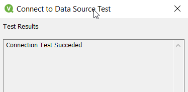

# Azure Databricks Integration with QlikView
## Components
- [x] Azure Databricks
- [x] QlikView Desktop

        Note: This tutorial/ guide is for Windows Machines 

### Instructions
1. First let's collect Azure Databricks related configuration as follows:
   - Select Cluster  
   Azure Databricks &#8594; Clusters (select the cluster for compute and return results to QlikView)
   - Get Configuration   
    Configuration tab &#8594; Advanced Settings &#8594; JDBC/ODBC
   - Gather following highlighted details

   - Generate personal token in Azure Databricks with proper comment and Lifetime (0 for live indefinitely) 
   User Settings &#8594; Generate New Token
   - Copy this data to some file for further use

2. Download Simba ODBC Driver from the link [Databricks-Simba-odbc-driver](https://databricks.com/spark/odbc-drivers-download) or alternatively get it from this git [prerequisites/SimbaODBCDriver.zip](https://github.com/Vinay26k/azure/blob/adb-qlikview-integration/databricks-qlikview/prerequisites/SimbaSparkODBC-2.6.16.1019-Windows-64bit.zip)
3. After extracting the downloaded file, we will have msi installer file as follows:
   
4. Install the driver, by choosing appropriate options
5. Navigate to setup Azure Databricks data source in the system as follows:  
   Control Panel &#8594; View by (Large Icons) at top right corner &#8594; Administrative Tools
   
   
6. Click Add in User DSN/ System DSN, based on your needs.
   
7. Make sure to select/ update with following configuration
   
    | Parameter/ Setting     | Value                                                    |
    | :--------------------- | :------------------------------------------------------- |
    | Data Source Name       | as required                                              |
    | Description            | optional                                                 |
    | Spark Server Type      | SparkThriftServer                                        |
    | Service Discovery Mode | No Service Discovery                                     |
    | Host                   | <HOST_FROM_DATABRICKS_CLUSTER>                           |
    | Port                   | <PORT_FROM_DATABRICKS_CLUSTER> (default value: 443)      |
    | Database               | default is sufficient for this integration               |
    | Authentication         | User Name and Password                                   |
    | User Name              | token                                                    |
    | Password               | <PERSONAL_ACCESS_TOKEN_GENERATED>                        |
    | Thrift Transport       | HTTP                                                     |
    | SSL Options            | Enable SSL (check this) & let it use default cacerts.pem |
    | HTTP Options           | <HTTP_PATH_FROM_DATABRICKS_CLUSTER>                      |
8. Test Connection (this starts the cluster if it's in terminated state and wait for the respone from cluster to the DSN ODBC driver Setup)
   - Result from DSN Setup
    
   - Spark UI/ Session details
    
9. Open QlikView and Edit Script (Ctrl+E)
10. Select ODBC Driver as follows:
    
11. Click connect and check Show USER DSNs (if you have setup USER DSN rather than System DSN) &#8594; Select Data Source name we have created &#8594; Click OK (if required, you can test connection) 
    
    
12. Click Select to select the database and tables to be loaded into QlikView reports as follows:
    - 
    - 
13. Click Reload once we have the SQL statement append to the file, this queries and loads data from databricks database to the qvw table object
14. Following is the data, when displayed using  
    Object &#8594; New Sheet Object &#8594; Table Box
    

 

# References
1. [Databricks Spark drivers](https://databricks.com/spark/odbc-drivers-download)
2. [DataStax Configuring Simba drivers](https://docs.datastax.com/en/dse/5.1/dse-dev/datastax_enterprise/spark/simbaOdbcDriverConfigWindows.html)
3. [simba-partners/databricks](https://www.simba.com/simba-partners/databricks-2/)

****
&nbsp;&nbsp;&nbsp;&nbsp;&nbsp;&nbsp;👨‍💻 [github.com/Vinay26k](https://github.com/Vinay26k)
